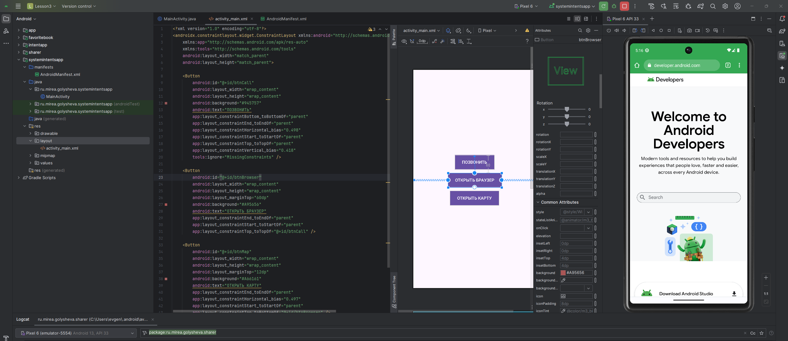

# Практическая работа №2

**Тема:** Намерения, обмен данными, вызов системных приложений и работа с фрагментами в Android‑приложениях

---

## Цель работы

Закрепить навыки:

- создания и обработки `Intent` (явных и неявных);
- передачи и получения данных между `Activity`;
- использования системных приложений Android (звонок, карта, браузер);
- реализации фрагментов с учетом смены ориентации экрана;
- применения **Activity Result API**.
  
---

## РАБОТА С НАМЕРЕНИЯМИ

Был создан модуль **IntentApp**. В нем реализованы две активности.

- В **MainActivity** получено текущее системное время и передано во вторую активность (SecondActivity) с помощью `Intent`.
- В **SecondActivity** отображается текст:
«КВАДРАТ ЗНАЧЕНИЯ МОЕГО НОМЕРА ПО СПИСКУ В ГРУППЕ СОСТАВЛЯЕТ **ЧИСЛО**, а текущее время **ВРЕМЯ**».

 
 

Также был изучен механизм получения результата от другой активности. В отличие от простого `Intent`, который просто запускает новое окно, `Activity Result API` позволяет:
- передать данные во вторую активность;
- получить данные обратно после её завершения.

 

---

## ОБМЕН ДАННЫМИ МЕЖДУ АКТИВНОСТЯМИ

Создан модуль **FavoriteBook** с двумя экранами: **MainActivity** и **ShareActivity**.

- На первом экране: TextView с начальным текстом и кнопка для перехода.
- На втором экране: TextView с любимой книгой разработчика и цитатой, два EditText для ввода пользовательских данных и кнопка для возврата.
- Передача и возврат данных реализованы через `Activity Result API`.

 
 
 

---

## ВЫЗОВ СИСТЕМНЫХ ПРИЛОЖЕНИЙ

Создан модуль **SystemIntentsApp**. Реализовано три кнопки:

- Позвонить — открывает экран набора номера.
- Открыть браузер — запускает браузер с сайтом.
- Открыть карту — запускает карту с координатами.

 
 
 
 

---

## Работа с фрагментами

Создан модуль **SimpleFragmentApp**. В нем реализовано два фрагмента:

- **FirstFragment** и **SecondFragment**, каждый отображает собственное сообщение.
- В **MainActivity** реализованы кнопки для переключения между фрагментами с помощью транзакций.

 
 

Добавлена поддержка горизонтальной ориентации с отображением обоих фрагментов одновременно (через файл `layout-land/activity_main.xml`).

 

---

## Итоги

В результате выполнения работы было освоено:

- создание и передача данных между активностями через `Intent`;

- реализация обмена информацией с помощью `Activity Result API`;

- использование системных приложений (звонки, карты, браузер);

- работа с `Fragment`, включая переключение и адаптацию к разной ориентации экрана.

---

**Выполнила**: Голышева Е.А.  
**Группа**: БСБО-09-22
